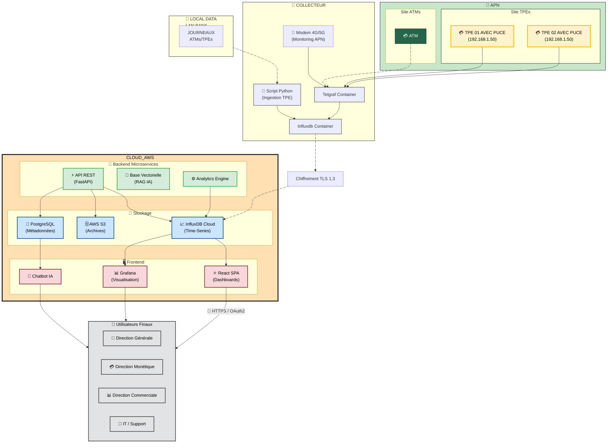

```mermaid
graph TB
 subgraph DC["🏢 COLLECTEUR"]
    direction TB
        SCRIPT["🐍 Script Python<br>(Ingestion TPE)"]
        MODEM["📱 Modem 4G/5G<br>(Monitoring APN)"]
        n7["Influxdb Container"]
        n8["Telgraf Container"]
  end
 subgraph BACKEND["🔧 Backend Microservices"]
        API["⚡ API REST<br>(FastAPI)"]
        RAG["🤖 Base Vectorielle<br>(RAG IA)"]
        ENGINE["⚙️ Analytics Engine"]
  end
 subgraph STORAGE["💾 Stockage"]
        INFLUX_CLOUD["📈 InfluxDB Cloud<br>(Time-Series)"]
        S3["🗄️ AWS S3<br>(Archives)"]
        POSTGRES["🐘 PostgreSQL<br>(Métadonnées)"]
  end
 subgraph FRONTEND["🖥️ Frontend"]
        REACT["⚛️ React SPA<br>(Dashboards)"]
        GRAFANA["📊 Grafana<br>(Visualisation)"]
        CHATBOT["💬 Chatbot IA"]
  end
 subgraph CLOUD_AWS["CLOUD_AWS"]
    direction TB
        BACKEND
        STORAGE
        FRONTEND
  end
 subgraph USERS["👥 Utilisateurs Finaux"]
        DG["👔 Direction Générale"]
        DM["💳 Direction Monétique"]
        DC_USER["📊 Direction Commerciale"]
        IT["🔧 IT / Support"]
  end
 subgraph SITE1["Site TPEs"]
        TPE1A["💳 TPE 01 AVEC PUCE<br>(192.168.1.50)"]
        n6["💳 TPE 02 AVEC PUCE<br>(192.168.1.50)"]
  end
 subgraph SITE2["Site ATMs<br>"]
        TPE2A["💳 ATM"]
  end
 subgraph SITES["🏪 APN"]
    direction TB
        SITE1
        SITE2
  end
 subgraph s1["🏢 LOCAL DATA<br>LAN BANK"]
        n5["JOURNEAUX<br>ATMs/TPEs"]
  end
    API --> INFLUX_CLOUD & S3 & POSTGRES
    ENGINE --> INFLUX_CLOUD
    INFLUX_CLOUD --> REACT & GRAFANA
    POSTGRES --> CHATBOT
    REACT -- 🔐 HTTPS / OAuth2 --> USERS
    GRAFANA --> USERS
    CHATBOT --> USERS
    s1 L_s1_SCRIPT_0@--> SCRIPT
    INFLUX["Chiffrement TLS 1.3"] L_INFLUX_INFLUX_CLOUD_0@--> INFLUX_CLOUD
    MODEM --> n8
    n8 --> n7
    SCRIPT --> n7
    TPE2A L_TPE2A_n8_0@--> n8
    TPE1A --> n8
    n6 --> n8
    n7 L_n7_INFLUX_0@--> INFLUX
    n7@{ shape: rect}
    n8@{ shape: rect}
    n6@{ shape: rect}
    n5@{ shape: rect}
     API:::backendStyle
     RAG:::backendStyle
     ENGINE:::backendStyle
     INFLUX_CLOUD:::storageStyle
     S3:::storageStyle
     POSTGRES:::storageStyle
     REACT:::frontendStyle
     GRAFANA:::frontendStyle
     CHATBOT:::frontendStyle
     DG:::userStyle
     DM:::userStyle
     DC_USER:::userStyle
     IT:::userStyle
     TPE1A:::cloudStyle
     n6:::cloudStyle
     TPE2A:::Pine
     USERS:::userStyle
     CLOUD_AWS:::cloudStyle
    classDef datacenterStyle fill:#d1f2eb,stroke:#16a085,stroke-width:3px,color:#000
    classDef backendStyle fill:#d4edda,stroke:#28a745,stroke-width:2px,color:#000
    classDef storageStyle fill:#cce5ff,stroke:#004085,stroke-width:2px,color:#000
    classDef frontendStyle fill:#f8d7da,stroke:#721c24,stroke-width:2px,color:#000
    classDef userStyle fill:#e2e3e5,stroke:#383d41,stroke-width:2px,color:#000
    classDef siteStyle fill:#e7f3ff,stroke:#0056b3,stroke-width:2px,color:#000
    classDef Pine stroke-width:1px, stroke-dasharray:none, stroke:#254336, fill:#27654A, color:#FFFFFF
    classDef cloudStyle fill:#fff3cd, stroke:#ffc107, stroke-width:3px, color:#000
    style SCRIPT stroke:#000000
    style n7 stroke:#000000
    style n8 stroke:#000000
    style TPE2A stroke:#000000
    style SITE1 stroke:#000000
    style s1 stroke:#000000
    style CLOUD_AWS fill:#FFE0B2,stroke:#000000
    style SITES fill:#C8E6C9,stroke:#000000
    style DC stroke:#000000
    L_s1_SCRIPT_0@{ animation: slow } 
    L_INFLUX_INFLUX_CLOUD_0@{ animation: slow } 
    L_TPE2A_n8_0@{ animation: slow } 
    L_n7_INFLUX_0@{ animation: slow }
```
